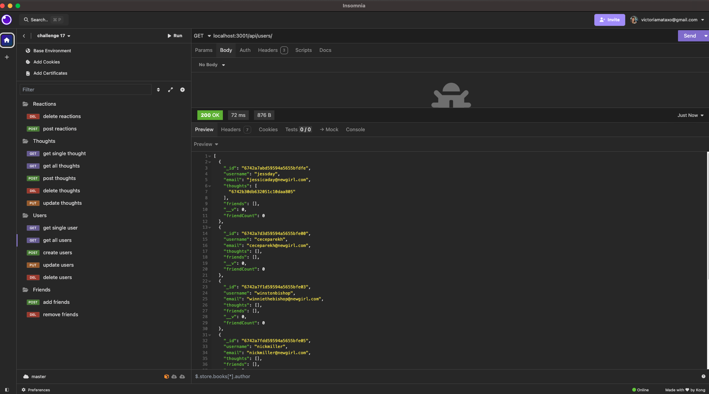

# SocialNetwork
 ## Description:
   This Social Networking application enables users to add/remove friends, share thoughts, as well as react to eachothers thoughts. You can create and delete users. This backend application was built from scratch using the following technologies: MongoDB, Express, and Mongoose ODM.
   ## Table of Contents:
   * [Installation](#installation)
   * [Usage](#usage)
   * [License](#license)
   * [Contributing](#contributing)
   * [Tests](#tests)
   * [Questions](#questions)
   ## Installation:
   You can clone this repository onto your local computer. Run the command "npm install" to install all modules. Run "npm run build" to compile the TypeScript into JavaScript. Start the application with "npm run start".
   ## Usage:
   API routes can be tested using Insomnia.
   Click on the video link to watch a demo.
  **Link to video** 

   Screenshots of this app:
  
  
   ## License: 
   
   [Click to read more!](https://opensource.org/licenses/MIT)
   ## Contributing:
   Victoria Mata
   ## Tests:
   N/A
   ## Questions:
   * Github: [Link to profile](https://github.com/victoriamata)
   * Email: victoriamataxo@gmail.com